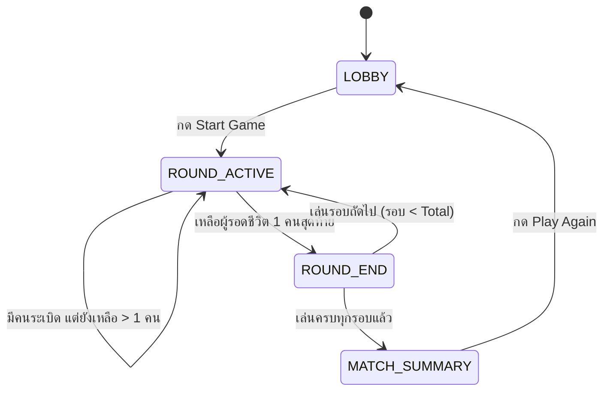

# 🎨 CatchMeGame - Game Design System & UI Architecture

เอกสารนี้ระบุการออกแบบสไตล์ภาพ (Visual Design), การออกแบบส่วนติดต่อผู้ใช้งาน (UI Architecture), ระบบ State Machine, และระบบแอนิเมชันของเกม **CatchMeGame (Hot Potato 3D)**

---

## 🌟 1. ปรัชญาการออกแบบภาพและสไตล์ (Visual Design Principles)

1. **Cyber-Fantasy & Neon Party Glow:**
   - ใช้โทนสีมืดแนวอวกาศ/แฟนตาซี (`#1a0d3a`) เป็นพื้นหลัง ผสานกับแสงนีออนเรืองแสงสีจัดจ้าน (ชมพู `#ff3366`, ฟ้ามินต์ `#33ffcc`, เหลืองทอง `#ffd93d`, ม่วง `#6633ff`) เพื่อสร้างบรรยากาศปาร์ตี้ที่สดใสและตื่นเต้น
2. **Low-Poly Procedural Geometry:**
   - โมเดลตัวละครและฉากทั้งหมดถูกสร้างแบบ Procedural ด้วยรูปทรงเรขาคณิตพื้นฐาน (Sphere, Cone, Capsule, Tube, Cylinder) และเรนเดอร์ด้วย `MeshLambertMaterial` พร้อม `flatShading: true` ทำให้ได้เหลี่ยมเงาที่คมชัดและมีสไตล์
3. **Clear Visual Feedback:**
   - ตัวละครที่ถือระเบิดจะมีลูกระเบิดลอยอยู่เหนือหัวพร้อมไฟกะพริบที่เต้นถี่ขึ้นตามเวลาที่ใกล้หมด
   - ตัวละครที่ถือระเบิดจะมีแสงเรืองแสงสีส้ม (`emissive: 0xff4400`) ล้อมรอบตัวชัดเจน
   - เมื่อระเบิดทำงาน จะมีแสงแฟลชสว่างวาบพร้อมละอองอนุภาคไฟสีส้มกระจายตัวออกรอบทิศ

---

## 🖥️ 2. สถาปัตยกรรม UI (User Interface Architecture)

การแสดงผลส่วนติดต่อผู้ใช้ถูกสร้างด้วย **React 19** ควบคู่กับ **Tailwind CSS v4** โดยใช้ดีไซน์สไตล์ **Glassmorphism**:

- **Lobby Screen (`Lobby.tsx`):**
  - แบ็กกราวด์มีไอคอนลอยตกแต่ง (`💣`, `⚡`, `🐱`, `🐭`, `✨`, `💥`) พร้อมแอนิเมชันลอยนุ่มนวล
  - การ์ดเลือกความยาวการแข่งขัน (3, 5, 7 รอบ) พร้อมปุ่มเริ่มเกมเรืองแสงขนาดใหญ่
- **HUD Overlay (`HUD.tsx`):**
  - ใช้ `pointer-events-none` ซ้อนทับบน 3D Canvas
  - กล่องแสดงรอบปัจจุบันที่มุมซ้ายบน
  - กล่องนับเวลาระเบิดแบบไดนามิกตรงกลางจอ (เปลี่ยนเป็นสีแดงพร้อมแอนิเมชันสั่นเมื่อเวลาต่ำกว่า 1.2 วินาที)
  - แถบแสดงสถานะผู้เล่นทุกคนที่มุมขวาบน (ใครถือระเบิด, ใครตกรอบ)
  - เกจวัดคูลดาวน์การพุ่งตัว (Dash Cooldown Bar) ที่มุมขวาล่าง
- **Round End Screen (`RoundEnd.tsx`):**
  - ตารางสรุปอันดับผู้รอดชีวิตในแต่ละรอบ
  - แสดงสถานะ `✓ Survived` หรือ `💀 Eliminated`
- **Match Summary Screen (`MatchSummary.tsx`):**
  - แสดงถ้วยรางวัลแชมเปี้ยน และเอฟเฟกต์กระดาษโปรย (Confetti)
  - จัดอันดับเหรียญทอง 🥇, เงิน 🥈, ทองแดง 🥉 และอันดับ 4

---

## 🔄 3. Finite State Machine ของเกมเพลย์

