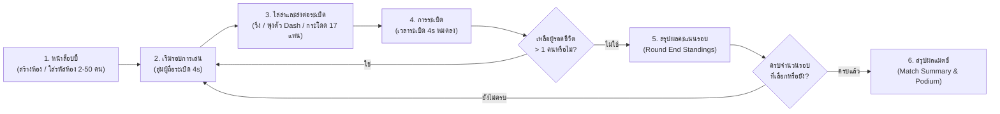

# 🎮 CatchMeGame (Hot Potato 3D) - Project Overview

**CatchMeGame** คือเว็บเกม 3 มิติแนวปาร์ตี้แบบ Fast-paced Casual Action (สไตล์ Hot Potato / Bomb Tag) ที่พัฒนาขึ้นบนเทคโนโลยีเว็บระดับสูงด้วย **React 19**, **Three.js**, **TypeScript**, **Tailwind CSS v4** และรันด้วย **Vite 8**

ผู้เล่นจะได้รับบทเป็นตัวละครในสมรภูมิสนามประลอง 3 มิติขนาดใหญ่ (90x90 เมตร) ที่ต้องคอยวิ่งหลบหนีหรือไล่ล่าเพื่อส่งต่อลูกระเบิดที่มีเวลานับถอยหลัง **4 วินาที** ก่อนที่จะเกิดการระเบิดครั้งใหญ่ ใครที่ถือระเบิดไว้ตอนเวลานับถอยหลังหมดลงจะถูกคัดออกจากการแข่งขันในรอบนั้นทันที! รองรับผู้เล่นจริงพร้อมกันได้ยืดหยุ่นตั้งแต่ **2 ถึง 50 คน (Pure PvP)** ผ่านระบบห้อง (Room Code) แบบไม่ต้องพึ่งพาเซิร์ฟเวอร์ภายนอก

---

## 🎯 เป้าหมายของระบบ (Project Goals)

- **Fast-Paced & Responsive Gameplay:** สร้างประสบการณ์เกมเพลย์ 3D บนเว็บเบราว์เซอร์ที่ลื่นไหล 60 FPS นิ่งสนิท ปราศจากการสะดุดจาก Garbage Collection
- **Clean & Decoupled Architecture:** ออกแบบโครงสร้างโค้ดด้วยแนวคิดการแยกส่วน Presentation (Three.js Mesh & React UI) ออกจาก Game Logic & Physics ตามกฎเหล็ก 15 ข้อใน [`REFACTORCODE.md`](file:///C:/Users/k2pwm/Downloads/CatchMeGame/markdowns/REFACTORCODE.md)
- **Data-Driven Configuration:** รวบรวมค่าคงที่ พิกัดจุดเกิด และสีสันไว้ในโมดูล `constants.ts` เพื่อให้ปรับสมดุลของเกมได้อย่างง่ายดาย
- **Zero-GC Update Loop:** ควบคุมการใช้งานหน่วยความจำใน Game Loop อย่างรัดกุมด้วย Reusable Vectors และ Float32Array ในอนุภาคระเบิดเพื่อประสิทธิภาพสูงสุด
- **Cross-Device Accessibility:** รองรับการเล่นบนทุกอุปกรณ์ ทั้งคีย์บอร์ดบนเดสก์ท็อป และหน้าจอสัมผัสบนสมาร์ทโฟน/แท็บเล็ตด้วยระบบ Virtual Joystick 8 ทิศทาง

---

## 🔄 ลูปการเล่นหลัก (Core Gameplay Loop)

1. **ระบบล็อบบี้และรหัสห้อง (Lobby & Room Code):**
   - **Host:** สร้างห้องแข่งขัน ได้รับรหัสสุ่ม (เช่น `CAT-784`) และเลือกจำนวนรอบแข่งขัน (3, 5, หรือ 7 รอบ)
   - **Guest:** นำรหัสห้องไปกรอกเพื่อเข้าร่วมห้องเดียวกัน รองรับผู้เล่น 2 ถึง 50 คน
2. **สุ่มผู้ถือระเบิด (Round Start):** ระบบสุ่มตัวละคร 1 ตัวให้เป็นผู้ถือระเบิด มีลูกระเบิดลอยกะพริบแสงสีส้มเหนือศีรษะ
3. **ส่งต่อระเบิด (Tag Passing):** ผู้ถือระเบิดต้องวิ่งไปชนผู้เล่นคนอื่นในระยะ **1.9 เมตร** เพื่อโอนระเบิดให้คนอื่น โดยเวลาระเบิดจะรีเซ็ตกลับเป็น **4 วินาที** ใหม่ทันที
4. **การเอาชีวิตรอดและการตกรอบ (Explosion & Elimination):** เมื่อเวลาระเบิดหมด ผู้ถือระเบิดจะระเบิดออกและตกรอบ คนที่เหลือจะแข่งขันกันต่อจนเหลือผู้รอดชีวิตคนสุดท้าย
5. **สรุปผลคะแนน (Round & Match Summary):** ระบบนับคะแนนการรอดชีวิตในแต่ละรอบ และเมื่อครบจำนวนรอบจะประกาศผู้ชนะเลิศพร้อมแท่นรับรางวัลและถ้วยเกียรติยศ

---

## ⭐ ฟีเจอร์หลักของเกม (Core Features)

1. **🧑‍🚀 การควบคุมและการเคลื่อนที่ (Player Controller):**
   - **Desktop Keyboard:** เคลื่อนที่ 3 มิติอย่างอิสระด้วยปุ่ม `WASD` หรือ `Arrow Keys` โดยหันหน้าและเคลื่อนที่ตามทิศทางมุมกล้องบุคคลที่ 3
   - **Mobile Touch Controls:** แผงควบคุมเสมือนบนหน้าจอ (Virtual Thumb Joystick 8 ทิศทาง 360 องศา พร้อมปุ่มสัมผัสกระโดด ⬆️ และพุ่งตัว ⚡)
   - **Dash Mechanic:** พุ่งตัวด้วยความเร็วสูงด้วยปุ่ม `Shift` (หรือแตะปุ่ม ⚡) ความเร็ว 24m/s นาน 0.18 วินาที (คูลดาวน์ 2.0 วินาที)
   - **Jump Mechanic:** กระโดดขึ้นสู่แท่นกระโดดต่างระดับด้วยปุ่ม `Spacebar` (หรือแตะปุ่ม ⬆️)
2. **🌐 ระบบผู้เล่นหลายคนแบบ Zero-Server (Multiplayer P2P):**
   - เชื่อมต่อระหว่างหน้าต่าง/แท็บเบราว์เซอร์ผ่าน `BroadcastChannel` โดยไม่ต้องพึ่งพาเซิร์ฟเวอร์ฐานข้อมูลภายนอก (ตามกฎข้อ 10 และ 14)
   - สถาปัตยกรรม **Host-Authoritative**: Host เป็นผู้คำนวณฟิสิกส์และการชน แล้วส่ง Snapshot ซิงค์ตำแหน่งที่ ~30 FPS ป้องกันปัญหาตำแหน่งไม่ตรงกัน (Desync)
3. **🏟️ สนามประลอง 3 มิติขนาดใหญ่ (90x90m 3D Arena):**
   - พื้นสนามประลองขนาด 90x90 เมตร พร้อมกำแพงนีออนโปร่งแสง 4 ด้าน
   - แพลตฟอร์มสิ่งกีดขวางต่างระดับ **17 แท่น** สำหรับปีนป่ายและกระโดดหลบหลีก
   - เห็ดเรืองแสงตกแต่งรอบสนาม 24 จุด และละอองดวงดาวระยิบระยับบนท้องฟ้า 600 จุด
4. **🖥️ Responsive UI & HUD สไตล์ Glassmorphism:**
   - แถบแสดงเวลาระเบิดกะพริบเตือนสีแดงสดใสเมื่อเวลาเหลือน้อยกว่า 1.2 วินาที
   - แถบเกจวัดคูลดาวน์การพุ่งตัว (Dash Bar)
   - Mobile Player Drawer สำหรับแตะดูรายชื่อผู้เล่นสูงสุด 50 คนโดยไม่บดบังสนาม 3D
   - หน้าจอสรุปผลสไตล์ Glassmorphism สวยงามพร้อมปุ่ม Next Round / Play Again
