# 📊 CatchMeGame - Use Case Diagram & System Specifications

เอกสารฉบับนี้แสดงโครงสร้างความสัมพันธ์ระหว่าง **ผู้แสดง (Actors)** และ **กรณีการใช้งาน (Use Cases)** ทั้งหมดของระบบเกม **CatchMeGame (Hot Potato 3D)** พัฒนาด้วย **React 19 + Three.js + TypeScript + Tailwind CSS v4**

---

## 👥 1. การจำแนกผู้แสดง (Actors Identification)

| ลำดับ | ชื่อ Actor | ประเภท | บทบาทและหน้าที่ (Role & Description) |
| :---: | :--- | :---: | :--- |
| **1** | **หัวหน้าห้อง (Host Player)** | **Primary Actor** | ผู้สร้างห้อง ได้รับรหัสห้องสุ่ม (Room Code) เลือกจำนวนรอบ (3/5/7) ควบคุมการกดเริ่มเกม และทำหน้าที่เป็น Serverless Simulation Host |
| **2** | **ผู้เข้าร่วมแข่งขัน (Client / Guest Player)** | **Primary Actor** | ผู้เข้าร่วมห้องด้วยการป้อนรหัสห้อง 6 หลัก ควบคุมตัวละครผ่าน Keyboard หรือ Virtual Touch Joystick ส่งอินพุตไปยัง Host |
| **3** | **ระบบเอนจินเกม (Three.js GameEngine)** | **Secondary Actor** | ขับเคลื่อน Game Loop 60 FPS, ฟิสิกส์การเคลื่อนที่, การชนแท่น 17 จุด, การส่งต่อระเบิด (Tag Passing 1.9m) และอนุภาคระเบิดแบบ Zero-GC |
| **4** | **ระบบเน็ตเวิร์ก (P2P NetworkManager)** | **Secondary Actor** | จัดการ BroadcastChannel, การรับส่งข้อความ Type-safe Messages, การซิงค์ตำแหน่ง Snapshot (~30 FPS) และการจัดการห้อง |
| **5** | **ระบบอินเทอร์เฟซผู้ใช้ (React UI Controller)** | **Secondary Actor** | จัดการลูปสถานะเกม (Lobby, Round Active, Round End, Match Summary), แผง HUD, Mobile Drawer และ Virtual Joystick |

---

## 🗺️ 2. แผนภาพ Use Case Diagram (Mermaid Visual Diagram)

```mermaid
flowchart TD
    %% ================= ACTORS =================
    subgraph Primary_Actors ["Primary Actors (ผู้เล่นคนจริง 2-50 คน)"]
        Host(("👑 หัวหน้าห้อง<br>(Host Player)"))
        Client(("🧑‍🚀 ผู้เล่นทั่วไป<br>(Guest Player)"))
    end

    subgraph System_Actors ["System & Engine Actors"]
        Engine(("⚡ Three.js Engine"))
        Network(("🌐 Network Manager"))
        UI(("🎨 React UI Controller"))
    end

    %% ================= SYSTEM BOUNDARY =================
    subgraph SystemBoundary ["ขอบเขตระบบเกม CatchMeGame (Game System)"]
        
        %% 1. Lobby & Room Management
        subgraph Sub_Lobby ["1. การจัดการห้องและล็อบบี้ (Lobby & Room Code)"]
            UC01["UC01: สร้างห้องแข่งขันใหม่ (Create Room)"]
            UC02["UC02: เข้าร่วมห้องด้วยรหัส (Join with Room Code)"]
            UC03["UC03: เลือกจำนวนรอบการเล่น (3/5/7 รอบ)"]
            UC04["UC04: เริ่มต้นเกมเมื่อผู้เล่นพร้อม (Start Game 2-50P)"]
            UC05["UC05: ออกจากห้อง (Leave Room)"]
        end

        %% 2. Gameplay & Cross-Platform Controls
        subgraph Sub_Gameplay ["2. เกมเพลย์และการควบคุม (Gameplay Actions)"]
            UC06["UC06: เคลื่อนที่ 3 มิติ (Keyboard WASD / Virtual Joystick)"]
            UC07["UC07: พุ่งตัวด้วยความเร็วสูง (Dash 24m/s)"]
            UC08["UC08: กระโดดขึ้นแท่นต่างระดับ 17 จุด (Jump)"]
            UC09["UC09: วิ่งชนส่งต่อลูกระเบิดระยะ 1.9m (Tag Pass)"]
            UC10["UC10: เปิดดูรายชื่อผู้เล่นทั้งหมด (Mobile Player Drawer)"]
        end

        %% 3. Simulation, Rules & Network Sync
        subgraph Sub_Simulation ["3. การจำลองฟิสิกส์และการซิงค์เน็ตเวิร์ก (Simulation & Sync)"]
            UC11["UC11: นับถอยหลังเวลาระเบิด 4 วินาที"]
            UC12["UC12: จำลองการระเบิดและคัดผู้เล่นออก (Zero-GC Explosion)"]
            UC13["UC13: ตรวจจับการชนแท่นและขอบสนาม 90x90m"]
            UC14["UC14: ซิงค์ตำแหน่งสถานะเกมข้ามแท็บ (Host-Authoritative Sync)"]
            UC15["UC15: สรุปผลคะแนนรอบและแมตช์ (Round End & Match Summary)"]
        end
    end

    %% ================= RELATIONSHIPS =================
    Host --> UC01
    Host --> UC03
    Host --> UC04
    Host --> UC06
    Host --> UC07
    Host --> UC08
    Host --> UC09

    Client --> UC02
    Client --> UC05
    Client --> UC06
    Client --> UC07
    Client --> UC08
    Client --> UC09
    Client --> UC10

    Host -.->|ส่งสัญญาณเริ่มเกม| Network
    Client -.->|ส่ง Key Inputs| Network
    Network <-->|Sync State ~30 FPS| Engine
    Engine --> UC11
    Engine --> UC12
    Engine --> UC13
    Engine --> UC14

    UI --> UC01
    UI --> UC02
    UI --> UC03
    UI --> UC10
    UI --> UC15
```

---

## 📋 3. รายละเอียดกรณีการใช้งานที่สำคัญ (Key Use Cases)

- **UC01 & UC02: จัดการห้องด้วย Room Code:** ผู้เล่นสร้างห้องแข่งขันหรือเข้าร่วมห้องด้วยรหัสห้องสุ่ม (เช่น `CAT-784`) รองรับ 2 ถึง 50 คนแบบ Pure PvP
- **UC04: เริ่มต้นเกมแบบยืดหยุ่น:** Host มีสิทธิ์กดเริ่มเกมได้ทันทีเมื่อมีผู้เล่นอย่างน้อย 2 คน โดยไม่ต้องรอบอท AI
- **UC06 & UC07: Cross-Platform Movement & Dash:** รองรับทั้งปุ่มกดเดสก์ท็อป และระบบสัมผัส Virtual Joystick 8 ทิศทาง พร้อมเกจคูลดาวน์ Dash 2.0 วินาที
- **UC09: ส่งต่อลูกระเบิด (Tag Passing):** เมื่อผู้ถือระเบิดเข้าใกล้ผู้เล่นอื่นในระยะ 1.9 เมตร ระเบิดจะถูกส่งต่อพร้อมรีเซ็ตเวลากลับเป็น 4 วินาทีทันที
- **UC12: การระเบิด (Zero-GC Explosion):** เมื่อเวลาระเบิดหมด ผู้ถือระเบิดจะระเบิดออกด้วยระบบ Float32Array Particle System และถูกคัดออกจากการแข่งขันในรอบนั้น
- **UC14: ซิงค์ข้อมูลเน็ตเวิร์ก (Host-Authoritative):** Host เป็นผู้ประมวลผลฟิสิกส์แล้วส่ง Snapshot กระจายไปยัง Client ทุกเครื่อง ป้องกันปัญหา Desync
